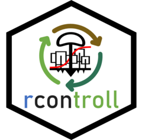

# *rcontroll*: individual-based forest growth simulator TROLL 

<!-- sticker("~/Téléchargements/TROLL.png", package="rcontroll", p_size=20, s_x=1, s_y = 0.85, s_width=.6, p_y = 1.6, filename="inst/figures/logo.png", h_color = "darkblue", h_fill = "white", p_color = "black") -->

[](https://github.com/gsalzet/rcontroll/actions)

*rcontroll* integrates the individual-based  and spatially-explicit *TROLL* model to simulate forest ecosystem and species dynamics forward in time.
*rcontroll* provides user-friendly functions to set up and analyse simulations with varying community compositions, ecological parameters, and climate conditions.

## Description

The *TROLL* simulator relies on a complex system of equations coded in C++ to efficiently simulate hundreds of individuals over hundreds of years.
In contrast, the *rcontroll* package relies on a few functions in R to generate and provide inputs, prepare and run the simulations, and analyse the simulations through tables, figures, and maps that are easily connected to the rest of the R package ecosystem. 
The whole workflow can even be run for one or several simulations using a unique function (`troll` and `stack` functions). 
Pre-simulations functions include global parameters definition (`generate_parameters` function) and species and weather data input, with default values for French Guiana included in the package.
Simulations are run alone (`troll` function) or as a stack (`stack` function) and stocked in corresponding `trollsim` or `trollstack`  classes.
The post-simulation outputs are stored in the corresponding `trollsim` or `trollstack` objects and can be accessed using object attributes (with `@` in R) in the form of simple R objects, mainly data frames, or summarised and plotted with the `print`, `summary` and `autoplot` methods. 
TROLL simulation or stack objects consist of 7 attributes: (1) simulation name, (2) path to saved files, (3) simulation parameters, (4) simulation log, (5) initial and final simulation forest, (6) ecosystem metrics, and (7) species metrics.
The initial and final forest of the simulation is a table containing spatialized inventories describing the individual states at the beginning and end of the simulation.
The ecosystem and species metrics are two tables summarising overall and species forest trajectories with several variables, including for example net primary productivity and aboveground biomass. 
Simulations can be saved using a user-defined path when run and later loaded as a simple simulation (`load_output` function) or a stack of simulations (`load_stack` function). 
Finally, rcontroll includes a function to visualise TROLL simulations as an animated figure (`autogif` function) to better understand, demonstrate or teach the functioning of the TROLL model.

## Installation

You can install the latest version of **rcontroll** from Github using the [`devtools`](https://github.com/hadley/devtools) package:

``` r
if (!requireNamespace("devtools", quietly = TRUE))
  install.packages("devtools")

devtools::install_github("sylvainschmitt/rcontroll")
```

## Usage

```r
library(rcontroll)
data("TROLLv3_species")
data("TROLLv3_climatedaytime12")
data("TROLLv3_daytimevar")
sim <- troll(name = "test",
             global = generate_parameters(iterperyear = 12, nbiter = 12*1),
             species = TROLLv3_species,
             climate = TROLLv3_climatedaytime12,
             daily = TROLLv3_daytimevar)
autoplot(sim, what = "species", 
         species = c("Cecropia_obtusa","Dicorynia_guianensis",
                     "Eperua_grandiflora","Vouacapoua_americana")) +
  theme(legend.position = "bottom")
```

